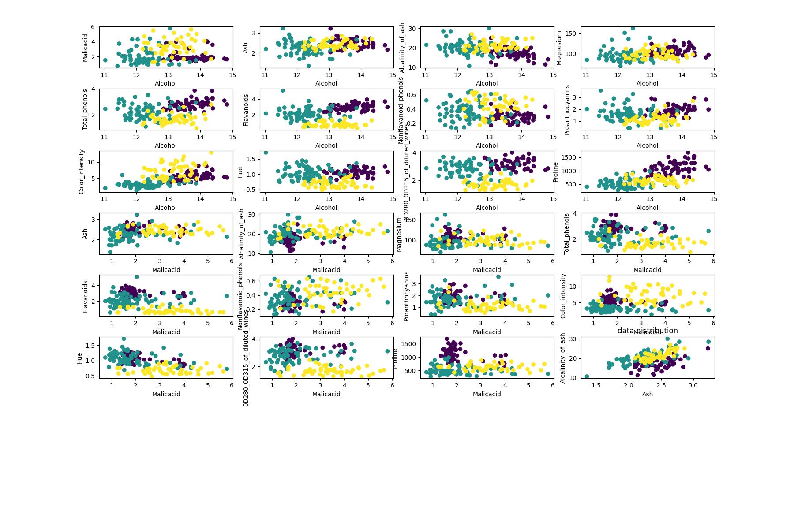

# Data Distribution Plots

Visual comparison of feature distributions for two UCI datasets:

- **Iris Dataset** – Sepal and petal measurements across three flower species.  

- **Wine Dataset** – Chemical composition of wines from three cultivars.

Each plot shows the spread and separability of features within each dataset.
